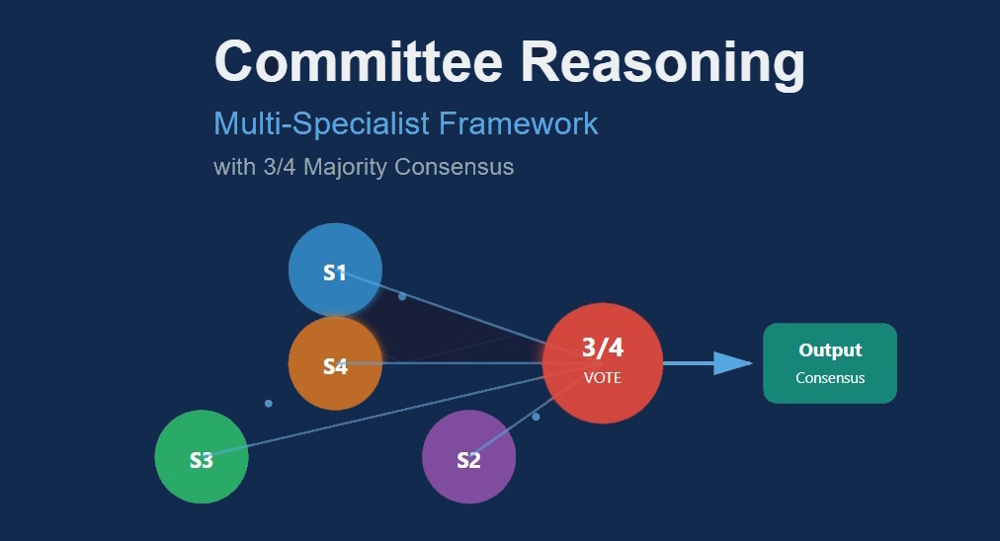

# Human-Like Committee Reasoning


**Author:** Songnian Qian  
**Role:** Senior Software Developer  
**Date:** October 17, 2025

---

## Concept Overview

This framework introduces a committee-based reasoning system that mirrors the four core mechanisms of human reasoning:

### 1. Abstraction and Compression
An auto-index network reduces rich input into essential meaning—equivalent to how human cognition compresses sensory data into concepts through perception and conceptualization.

### 2. Specialization and Parallel Reasoning
Four specialized transformer networks act like experts with different reasoning styles or knowledge domains—equivalent to divided cognition where humans consult different "mental experts" for logic, emotion, memory, and pattern recognition.

### 3. Agreement and Consensus
A Boltzmann-style evaluator functions as a collective decision maker, finding coherence among multiple viewpoints through 3/4 majority voting—equivalent to internal deliberation or "mental voting" when weighing competing thoughts.

### 4. Feedback Loop
An iterative refinement process re-feeds prior outputs when models disagree—equivalent to self-correction and "thinking twice" in human metacognition.

---

## Key Insight

> "Human reasoning itself is a biological Turing machine, and I'm modeling it"

Unlike current single-pass language models that generate responses in one forward pass, this system engages in genuine deliberation: specialists automatically develop distinct perspectives through unsupervised data clustering, while adaptive feedback mechanisms refine both routing decisions and confidence thresholds. 

The result is a reasoning architecture that improves robustness and reliability by structurally embodying the parallel, deliberative nature of human thought.

*A multi-stage reasoning framework inspired by human thought. Input is segmented, abstracted, and routed to specialist transformers. A Boltzmann-style evaluator and adaptive feedback drive the system toward a majority-vote consensus (3/4) rather than unanimity, with memory, goals, and value weighting guiding decisions.*

---

## System Architecture

### 1. Paragraph Division
Split input into paragraphs/logical units as independent reasoning fragments.

### 2. Auto-Index Neural Network (Abstraction + Compression)
- Compact encoder with attention + FFN creates compressed abstract representations of paragraphs
- Final few nodes indicate conceptual clusters; strongest activation assigns each paragraph to one of n groups (e.g., n=4)
- Functions as a conceptual compressor + router

### 3. Specialized Transformer Networks
- One specialist transformer per group learns its domain/reasoning style
- Trained on grouped paragraphs (plus some undivided contexts) to keep coherence

### 4. Multi-Response Generation
For a prompt, all four (or top-k) specialists produce answers, each with an internal confidence/uncertainty signal. SwiftTransformer implementation keeps this speedy!

### 5. Agreement & Evaluation (Boltzmann Reasoning Unit)
Attention+FFN-enhanced Boltzmann-style evaluator ingests the four answers and outputs:
- **Majority verdict:** whether ≥3 answers are semantically aligned
- **Agreement confidence:** continuous score
- **Pairwise similarity map:** to visualize/score alignment

> **Knowledge is in the dataset; it just depends on who you ask.** A physicist, historian, engineer, and philosopher all have access to the same underlying facts, but they retrieve and synthesize information differently based on their training and perspective.

### 6. Majority-Vote Consensus Policy (3/4)
- **Primary rule:** If 3 of 4 specialists agree semantically, accept consensus
- **Tie case (2–2 split):** No consensus—trigger refinement loop
- **Low-confidence override:** Even with 3/4, if group confidence is below a goal-dependent threshold, escalate to refinement
- **Selection within majority:** Return either:
  - (a) the highest-confidence answer among the majority, or
  - (b) a fused summary aligned with the majority cluster
- **Minority report:** Log the minority viewpoint to memory for future learning and diagnostics

### 7. Memory Integration
- **Short-term memory:** recent prompts, answers, and vote margins
- **Long-term memory:** stable abstractions, success/failure traces, expert reliability stats
- Memory weights can be margin-aware (3–1 > 3–1 with low confidence > 2–2)

### 8. Feedback & Self-Adjustment (Refinement Loop)
**Triggered when:**
- (a) 2–2 split
- (b) 3–1 but confidence too low
- (c) safety/goal checks fail

**Process:**
- **Cross-conditioning:** Feed original prompt plus differing answers back to specialists for revision
- **Adaptive learning:** Use disagreement statistics to adjust auto-index routing priors and expert influence weights
- **Loop limits:** Stop on convergence to 3/4 majority with adequate confidence, or after R rounds (early stop if similarity stagnates)

### 9. Goal & Value Modulation
Meta-controller encodes objectives (accuracy, creativity, efficiency, safety) and sets:
- Confidence thresholds for accepting 3/4
- Whether to consult all 4 or top-k specialists
- When to escalate to refinement despite a majority
- Value weighting layer raises thresholds for high-risk queries

### 10. Hierarchical Abstraction
Aggregate paragraph-level clusters into higher-order themes for multi-level reasoning (bottom-up synthesis, top-down guidance).

### 11. Imagination / Hypothesis Generation
On persistent disagreement, spawn hypotheses (alternative framings/counterfactuals) and re-evaluate them under the same 3/4 rule.

### 12. Self-Evaluation & Confidence Calibration
Final output carries a calibrated confidence combining:
- Majority size (3–1 vs 4–0)
- Individual model certainty
- Historical reliability from memory
- Goal-conditioned thresholds

---

## Expected Outcomes (with Majority Rule)

- **Robustness:** Majority voting reduces deadlocks vs unanimity and mirrors human committee decisions
- **Efficiency:** Fewer refinement rounds on average; early acceptance when 3/4 is confident
- **Traceability:** Minority reports preserve dissent for future learning and audits
- **Adaptivity:** Feedback adjusts routing and influence weights based on vote patterns and outcomes

---

## Operational Notes

### Quorum
Prefer all 4; allow top-k (e.g., 3) when routing is confident, but require 2/3 majority in that case.

### Edge Case Handling

**2–2 split:**
- Always refine (or escalate to external verification if available)

**3–1 with low confidence:**
- Refine once; if still low, return best-confidence answer with caution tag

**4–0 with low confidence:**
- Verify against memory/goals; low confidence may indicate out-of-distribution or ambiguity

### Learning Signals
Weight updates scale with vote margin and correctness feedback (when available).

---

## Installation

```bash
# Clone the repository
git clone https://github.com/yourusername/human-like-committee-reasoning.git
cd human-like-committee-reasoning

# Install dependencies
pip install -r requirements.txt
```

## Usage

```python
from committee_reasoning import CommitteeReasoner

# Initialize the reasoner
reasoner = CommitteeReasoner(
    num_specialists=4,
    consensus_threshold=0.75,
    max_refinement_rounds=3
)

# Process input
result = reasoner.process(input_text)
print(f"Consensus: {result.consensus}")
print(f"Confidence: {result.confidence}")
print(f"Minority report: {result.minority_report}")
```

## Contributing

Contributions are welcome! Please feel free to submit a Pull Request.


## Contact

**Songnian Qian**  
Senior Software Developer  
[Your Contact Information]

---

*"Human reasoning itself is a biological Turing machine, and I'm modeling it"*
